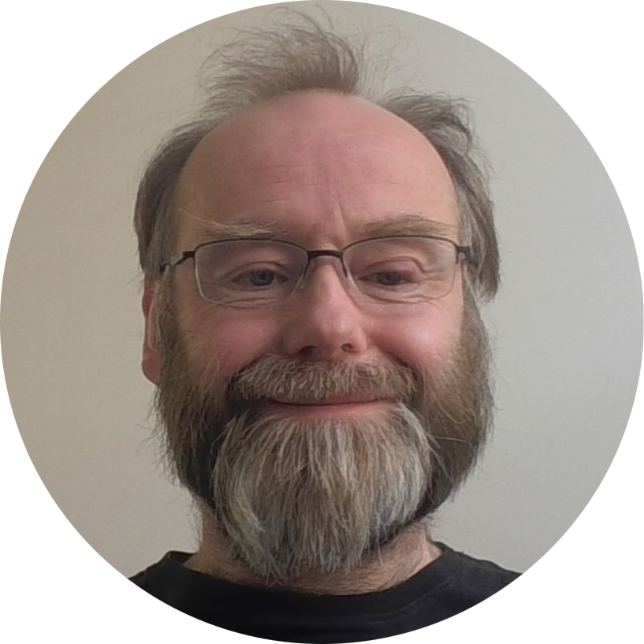

---
hide:
  - navigation
  - toc
---

# Meet the team

<!-- 
TO ADD A NEW TEAM MEMBER:
1. Copy and paste one of the `
...
` blocks below.
2. Update the details (photo, name, title, research interests, bio, links, outputs).
   Every part you need to edit has a comment beside it (e.g. --Photo--).
3. Insert the new card *above* the "end of team-container" message near the bottom of this file.

To delete a member, just remove their `
...
` block.
-->

   <!--Photo-->
  <h3>Dan Joyce</h3>
  
Professor of Connected Mental Health
 <!--Job title-->
  

    <h5>Research interests:</h5>
    <ul>                           <!--Set research interests-->
      <li>Psychiatry</li>
      <li>Data science and computational methods</li>
      <li>Digital mental health</li>
    </ul>
  

  
    <!--Short bio, ~80 words-->
      <h5>About:</h5>
    
After training as a computer scientist, I worked in computational modelling of language followed by a spell in experimental cognitive science and psychophysics. After retraining in medicine, I completed core and higher training in psychiatry as an NIHR academic clinical fellow, then lecturer. I'm primarily interested in how rational applications of computational methods (including contemporary ML and AI) can improve how we understand and treat mental illness.

    
  <!--Email, LinkedIn, Website, GitHub links -- just delete anything you don't want -->
      <a href="mailto:D.Joyce@liverpool.ac.uk"> Email</a>
      <a href="https://www.linkedin.com/in/dan-w-joyce-6870166b/"> LinkedIn</a>
      <a href="https://www.danwjoyce.com"> Website</a>
      <a href="https://github.com/danwjoyce"> GitHub</a>
    

    <h5>Featured outputs:</h5>  <!--Add up to 3 featured output URLs and titles below-->
    <ul>
      <li><a href="https://www.nature.com/articles/s41746-023-00751-9">Explainable artificial intelligence for mental health through transparency and interpretability for understandability</a></li>
      <li><a href="https://www.sciencedirect.com/science/article/pii/S0933365724002306">Model development for bespoke large language models for digital triage assistance in mental health care</a></li>
      <li><a href="https://translational-medicine.biomedcentral.com/articles/10.1186/s12967-016-1116-1">Realising stratified psychiatry using multidimensional signatures and trajectories</a></li>
    </ul>
    

  

   <!--Photo-->
  <h3>Yi Dong</h3>
  
Lecturer in Artificial Intelligence
 <!--Job title-->
  

    <h5>Research interests:</h5>
    <ul>                      <!--Set research interests-->
      <li>Trustworthy AI</li>
      <li>Autonomous Systems</li>
      <li>Distributed Optimisation and Control</li>
    </ul>
  

  
    <!--Short bio, ~80 words-->
      <h5>About:</h5>
    
I am an Early Career Academic and Lecturer at the University of Liverpool with expertise in trustworthy AI. My research interests include AI, Robotics, trustworthy systems, and energy systems. I have secured multiple research grants from UKRI, Innovate UK, ATI, Royal Society, and have contributed to projects totalling over £20M (e.g. EnnCORE, FOCETA, RobustifAI). Our team won the UK-US privacy-enhancing technologies prize challenges with the recognition of Novel Modelling/Design in 2023. I have authored 30+ publications in top-tier venues, such as ICML, ICCV, AAMAS, etc. I also serve as an Area Chair, PC member or Organising team member for conferences including NeurIPS, AAAI, ECAI, and UKAIRS.

    
  <!--Email, LinkedIn, Website, GitHub links -- just delete anything you don't want -->
      <a href="mailto:yi.dong@liverpool.ac.uk"> Email</a>
      <a href="https://www.linkedin.com/in/yi-dong-323319170"> LinkedIn</a>
      <a href="https://cgi.csc.liv.ac.uk/~yidong"> Website</a>
      <a href="https://github.com/YD-19"> GitHub</a>
    

    <h5>Featured outputs:</h5>  <!--Add up to 3 featured output URLs and titles below-->
    <ul>
      <li><a href="https://dl.acm.org/doi/abs/10.5555/3692070.3692521">Building Guardrails for Large Language Models</a></li>
      <li><a href="https://doi.org/10.1109/LRA.2024.3364471">Reachability Verification Based Reliability Assessment for Deep Reinforcement Learning Controlled Robotics and Autonomous Systems</a></li>
      <li><a href="https://doi.org/10.1145/3570918">Reliability Assessment and Safety Arguments for Machine Learning Components in Assuring Learning-Enabled Autonomous Systems</a></li>
    </ul>
  

   <!--Photo-->
  <h3>Peiyun Hu</h3>
  
Postdoctoral Research Associate
 <!--Job title-->
  

    <h5>Research interests:</h5>
    <ul>                      <!--Set research interests-->
      <li>Cardiovascular disease (CVD) and antipsychotic medications</li>
      <li>Real-world data / electronic health records (EHR)</li>
      <li>Predictive modelling and statistical methods</li>
    </ul>
  

  
    <!--Short bio, ~80 words-->
      <h5>About:</h5>
    
I am currently a Postdoctoral Research Associate in Primary Care and Mental Health at the Department of Institute of Population Health, with a PhD in Statistics from the Department of Mathematics, University of York. My current research focuses on analysing large-scale longitudinal electronic health records to investigate CVD risk among individuals treated with antipsychotic medications.

    
My research interests lie in statistical methodologies for big data and predictive modelling. I am deepening my expertise in areas such as survival analysis, causal inference, and joint modelling. My academic background spans mathematical statistics, computational modelling, and health data science, and I am passionate about contributing to collaborative research at the intersection of clinical epidemiology and data analytics.

    
I am currently working on the PreCAP project, which uses linked CPRD primary and secondary care data to model cardiovascular risk in individuals prescribed antipsychotic medication.

    
 <!--Email, LinkedIn, Website, GitHub links -- just delete anything you don't want -->
      <a href="mailto:Peiyun.Hu@liverpool.ac.uk"> Email</a>
      <a href="https://www.linkedin.com/in/peihu816"> LinkedIn</a>
    

    </ul>
  

   <!--Photo-->
  <h3>Yu Fu</h3>
  
Senior Lecturer
 <!--Job title-->
  

    <h5>Research interests:</h5>
    <ul>                      <!--Set research interests-->
      <li>Mental-physical MLTCs</li>
      <li>Mental health safe prescribing</li>
      <li>Health inequalities</li>
    </ul>
  

  
    <!--Short bio, ~80 words-->
      <h5>About:</h5>
    
I am a Senior Lecturer and NIHR Advanced Fellow with clinical and academic backgrounds in medicine, public health and applied health research. My work focuses on physical–mental multimorbidity, leading research that benefits patients and families. I have extensive experience across multiple long-term conditions in mental health, primary care and community settings, using real-world evaluation to develop, refine and implement complex interventions that inform practice and policy. I draw on diverse methodologies and have delivered systematic reviews, natural and quasi-experimental studies with electronic health records, qualitative research and clinical trials funded by prestigious bodies. I currently sit on the NIHR RfPB funding committee and am a member of the NIHR Statistics Group Routine Data section, Methodology and Mental Health Research Incubators.

    
 <!--Email, LinkedIn, Website, GitHub links -- just delete anything you don't want -->
      <a href="mailto:Yu.Fu@liverpool.ac.uk"> Email</a>
      <a href="https://www.linkedin.com/in/yu-maggie-fu-88239b55/?originalSubdomain=uk"> LinkedIn</a>
      <a href="https://www.liverpool.ac.uk/people/yu-fu"> Website</a>
    

    <h5>Featured outputs:</h5>  <!--Add up to 3 featured output URLs and titles below-->
    <ul>
      <li><a href="https://www.sciencedirect.com/science/article/pii/S0033350624002877">Impact of pandemics on primary care: changes in general practitioner antidepressant prescriptions and mental health referrals during lockdowns in England, UK</a></li>
      <li><a href="https://bmjopen.bmj.com/content/12/11/e066868.abstract">Cardiovascular-related conditions and risk factors in primary care for deprived communities before and during the COVID-19 pandemic: an observational study in Northern England</a></li>
      <li><a href="https://bjgp.org/content/75/750/9">'Flattened, fattened, and forgotten': the 'dis-integrated' care of patients prescribed antipsychotics in the UK</a></li>
    </ul>
  

   <!--Photo-->
  <h3>David O'Hagan</h3>
  
PhD Student in Public Health
 <!--Job title-->
  

    <h5>Research interests:</h5>
    <ul>                      <!--Set research interests-->
      <li>CKD (Chronic Kidney Disease)</li>
      <li>Mental Health</li>
      <li>General Practice and Public Health</li>
      <li>NHS Systems</li>
    </ul>
  

  
    <!--Short bio, ~80 words-->
      <h5>About:</h5>
    
PhD student University of Liverpool funded project on CKD and Mental Health. Looking at epidemiology and social determinants as well as models utilising longitudinal data (eGFR) in understanding overlapping long term conditions.

    
Experienced GP, since 2002. Ex CCG Board member with experience supporting hospital trust, audit and finance committee.

    
 <!--Email, LinkedIn, Website, GitHub links -- just delete anything you don't want -->
      <a href="https://drdavidohagan.co.uk/"> Website</a>
      <a href="https://www.linkedin.com/in/david-o-hagan-76594961/"> LinkedIn</a>
      <a href="https://x.com/drdavidohagan"> X</a>
      <a href="https://bsky.app/profile/drdavidohagan.bsky.social"> BlueSky</a>
      <a href="https://github.com/davidpohagan"> GitHub</a>
    

  

   <!--Photo-->
  <h3>Sam Osian</h3>
  
PhD Student in Health Data Science
 <!--Job title-->
  

    <h5>Research interests:</h5>
    <ul>                      <!--Set research interests-->
      <li>Natural language processing</li>
      <li>Coronial data</li>
      <li>Suicide prevention</li>
    </ul>
  

  
    <!--Short bio, ~80 words-->
      <h5>About:</h5>
    
I am a PhD student working at the intersection of open data, open source technology, and suicide prevention. My current research interest centres on how data from coroners’ inquests can be used to identify and respond to preventable deaths more effectively. I'm particularly interested in how advances in large language models are opening up new possibilities for analysing text at a scale and depth that simply wasn’t possible before.

    
 <!--Email, LinkedIn, Website, GitHub links -- just delete anything you don't want -->
      <a href="https://sam-osian.com/"> Website</a>
      <a href="mailto:samoand@liverpool.ac.uk"> Email</a>
      <a href="https://www.linkedin.com/in/sam-o-andrews/"> LinkedIn</a>
      <a href="https://github.com/Sam-Osian/"> GitHub</a>
    

    <h5>Featured outputs:</h5>   <!--Add up to 3 featured output URLs and titles below-->
    <ul>
      <li><a href="https://arxiv.org/abs/2507.20786">Automating Thematic Review of Prevention of Future Deaths Reports: Replicating the ONS Child Suicide Study using Large Language Models</a></li>
    </ul>
  

 <!-- end of team-container -->

  

    &times;
    

  

