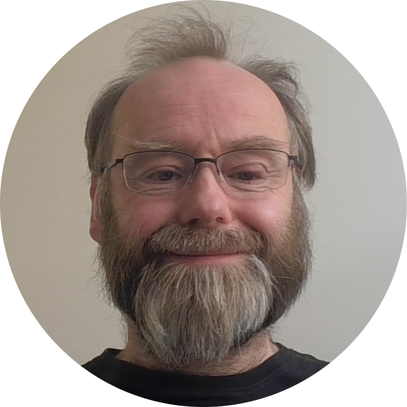

---
hide:
  - navigation
  - toc
---

# Meet the team

<!-- 
TO ADD A NEW TEAM MEMBER:
1. Copy and paste one of the `
...
` blocks below.
2. Update the details (photo, name, title, research interests, bio, links, outputs).
   Every part you need to edit has a comment beside it (e.g. --Photo--).
3. Insert the new card *above* the "end of team-container" message near the bottom of this file.

To delete a member, just remove their `
...
` block.
-->

   <!--Photo-->
  <h3>Dan Joyce</h3>
  
Professor of Connected Mental Health
 <!--Job title-->
  

    <h5>Research interests:</h5>
    <ul>                           <!--Set research interests-->
      <li>Psychiatry</li>
      <li>Data science and computational methods</li>
      <li>Digital mental health</li>
    </ul>
  

  
    <!--Short bio, ~80 words-->
      <h5>About:</h5>
    
After training as a computer scientist, I worked in computational modelling of language followed by a spell in experimental cognitive science and psychophysics. After retraining in medicine, I completed core and higher training in psychiatry as an NIHR academic clinical fellow, then lecturer. I'm primarily interested in how rational applications of computational methods (including contemporary ML and AI) can improve how we understand and treat mental illness.

    
  <!--Email, LinkedIn, Website, GitHub links -- just delete anything you don't want -->
      <a href="mailto:D.Joyce@liverpool.ac.uk"> Email</a>
      <a href="https://www.linkedin.com/in/dan-w-joyce-6870166b/"> LinkedIn</a>
      <a href="https://www.danwjoyce.com"> Website</a>
      <a href="https://github.com/danwjoyce"> GitHub</a>
    

    <h5>Featured outputs:</h5>  <!--Add up to 3 featured output URLs and titles below-->
    <ul>
      <li><a href="https://www.nature.com/articles/s41746-023-00751-9">Explainable artificial intelligence for mental health through transparency and interpretability for understandability</a></li>
      <li><a href="https://www.sciencedirect.com/science/article/pii/S0933365724002306">Model development for bespoke large language models for digital triage assistance in mental health care</a></li>
      <li><a href="https://translational-medicine.biomedcentral.com/articles/10.1186/s12967-016-1116-1">Realising stratified psychiatry using multidimensional signatures and trajectories</a></li>
    </ul>
  

   <!--Photo-->
  <h3>Eduard Shantsila</h3>
  
Head of Department of Primary Care and Mental Health
 <!--Job title-->
  

    <h5>Research interests:</h5>
    <ul>                           <!--Set research interests-->
      <li>Hypertension</li>
      <li>Cardiovascular prevention</li>
      <li>Data science</li>
      <li>Digital technologies in general practice</li>
    </ul>
  

  
    <!--Short bio, ~80 words-->
      <h5>About:</h5>
    
I am an academic GP with a cardiology background. I joined the University of Liverpool in August 2021, moving from Birmingham after completing GP training in 2020 and working full-time as a GP during the COVID-19 pandemic. I participate in multidisciplinary research collaborations focusing on cardiovascular health (hypertension, atrial fibrillation, heart failure), especially in the context of medical complexity, multimorbidity, polypharmacy and frailty.

    
I joined the Institute of Cardiovascular Sciences at City Hospital in Birmingham in 2008 to undertake a research fellowship funded by the Heart Failure Association of the European Society of Cardiology. This collaborative research between primary and secondary care led to a PhD with the Department of Primary Care Clinical Sciences at the University of Birmingham. I continued work at the Institute of Cardiovascular Sciences at the City Hospital in Birmingham, splitting my time between clinical cardiology duties and postdoctoral research.

    
I initiated clinical research on monocytes in cardiovascular pathology, leading an internationally recognised group. I was a co-PI of an NIHR-funded IMPRESS-AF trial of spironolactone in atrial fibrillation with preserved ejection fraction and developed skills in quantitative research as a member of the E-ECHOES Study (Ethnic - Echocardiographic Heart of England Screening Study) team.

    
  <!--Email, LinkedIn, Website, GitHub links -- just delete anything you don't want -->
      <a href="mailto:eduard.shantsila@liverpool.ac.uk"> Email</a>
      <a href="https://www.linkedin.com/in/eduard-shantsila-706b2219/"> LinkedIn</a>
      <a href="https://github.com/Edelar"> GitHub</a>
      <a href="https://www.liverpool.ac.uk/people/eduard-shantsila-2"> Website</a>
    

    <h5>Featured outputs:</h5>  <!--Add up to 3 featured output URLs and titles below-->
    <ul>
      <li><a href="https://pubmed.ncbi.nlm.nih.gov/32909497/">Spironolactone in Atrial Fibrillation With Preserved Cardiac Fraction: The IMPRESS-AF Trial</a></li>
      <li><a href="https://pubmed.ncbi.nlm.nih.gov/37706514/">Left Ventricular Hypertrophy and Mortality in Ethnic Minority Groups in the UK: e-ECHOES Study</a></li>
      <li><a href="https://pubmed.ncbi.nlm.nih.gov/27930355/">Premature Cardiac Aging in South Asian Compared to Afro-Caribbean Subjects in a Community-Based Screening Study</a></li>
    </ul>
    

  

   <!--Photo-->
  <h3>Yi Dong</h3>
  
Lecturer in Artificial Intelligence
 <!--Job title-->
  

    <h5>Research interests:</h5>
    <ul>                      <!--Set research interests-->
      <li>Trustworthy AI</li>
      <li>Autonomous Systems</li>
      <li>Distributed Optimisation and Control</li>
    </ul>
  

  
    <!--Short bio, ~80 words-->
      <h5>About:</h5>
    
I am an Early Career Academic and Lecturer at the University of Liverpool with expertise in trustworthy AI. My research interests include AI, Robotics, trustworthy systems, and energy systems. I have secured multiple research grants from UKRI, Innovate UK, ATI, Royal Society, and have contributed to projects totalling over £20M (e.g. EnnCORE, FOCETA, RobustifAI). Our team won the UK-US privacy-enhancing technologies prize challenges with the recognition of Novel Modelling/Design in 2023. I have authored 30+ publications in top-tier venues, such as ICML, ICCV, AAMAS, etc. I also serve as an Area Chair, PC member or Organising team member for conferences including NeurIPS, AAAI, ECAI, and UKAIRS.

    
  <!--Email, LinkedIn, Website, GitHub links -- just delete anything you don't want -->
      <a href="mailto:yi.dong@liverpool.ac.uk"> Email</a>
      <a href="https://www.linkedin.com/in/yi-dong-323319170"> LinkedIn</a>
      <a href="https://cgi.csc.liv.ac.uk/~yidong"> Website</a>
      <a href="https://github.com/YD-19"> GitHub</a>
    

    <h5>Featured outputs:</h5>  <!--Add up to 3 featured output URLs and titles below-->
    <ul>
      <li><a href="https://dl.acm.org/doi/abs/10.5555/3692070.3692521">Building Guardrails for Large Language Models</a></li>
      <li><a href="https://doi.org/10.1109/LRA.2024.3364471">Reachability Verification Based Reliability Assessment for Deep Reinforcement Learning Controlled Robotics and Autonomous Systems</a></li>
      <li><a href="https://doi.org/10.1145/3570918">Reliability Assessment and Safety Arguments for Machine Learning Components in Assuring Learning-Enabled Autonomous Systems</a></li>
    </ul>
  

   <!--Photo-->
  <h3>Peiyun Hu</h3>
  
Postdoctoral Research Associate
 <!--Job title-->
  

    <h5>Research interests:</h5>
    <ul>                      <!--Set research interests-->
      <li>Cardiovascular disease (CVD) and antipsychotic medications</li>
      <li>Real-world data / electronic health records (EHR)</li>
      <li>Predictive modelling and statistical methods</li>
    </ul>
  

  
    <!--Short bio, ~80 words-->
      <h5>About:</h5>
    
I am currently a Postdoctoral Research Associate in Primary Care and Mental Health at the Department of Institute of Population Health, with a PhD in Statistics from the Department of Mathematics, University of York. My current research focuses on analysing large-scale longitudinal electronic health records to investigate CVD risk among individuals treated with antipsychotic medications.

    
My research interests lie in statistical methodologies for big data and predictive modelling. I am deepening my expertise in areas such as survival analysis, causal inference, and joint modelling. My academic background spans mathematical statistics, computational modelling, and health data science, and I am passionate about contributing to collaborative research at the intersection of clinical epidemiology and data analytics.

    
I am currently working on the PreCAP project, which uses linked CPRD primary and secondary care data to model cardiovascular risk in individuals prescribed antipsychotic medication.

    
 <!--Email, LinkedIn, Website, GitHub links -- just delete anything you don't want -->
      <a href="mailto:Peiyun.Hu@liverpool.ac.uk"> Email</a>
      <a href="https://www.linkedin.com/in/peihu816"> LinkedIn</a>
    

    </ul>
  

   <!--Photo-->
  <h3>Yu Fu</h3>
  
Senior Lecturer
 <!--Job title-->
  

    <h5>Research interests:</h5>
    <ul>                      <!--Set research interests-->
      <li>Mental-physical MLTCs</li>
      <li>Mental health safe prescribing</li>
      <li>Health inequalities</li>
    </ul>
  

  
    <!--Short bio, ~80 words-->
      <h5>About:</h5>
    
I am a Senior Lecturer and NIHR Advanced Fellow with clinical and academic backgrounds in medicine, public health and applied health research. My work focuses on physical–mental multimorbidity, leading research that benefits patients and families. I have extensive experience across multiple long-term conditions in mental health, primary care and community settings, using real-world evaluation to develop, refine and implement complex interventions that inform practice and policy. I draw on diverse methodologies and have delivered systematic reviews, natural and quasi-experimental studies with electronic health records, qualitative research and clinical trials funded by prestigious bodies. I currently sit on the NIHR RfPB funding committee and am a member of the NIHR Statistics Group Routine Data section, Methodology and Mental Health Research Incubators.

    
 <!--Email, LinkedIn, Website, GitHub links -- just delete anything you don't want -->
      <a href="mailto:Yu.Fu@liverpool.ac.uk"> Email</a>
      <a href="https://www.linkedin.com/in/yu-maggie-fu-88239b55/?originalSubdomain=uk"> LinkedIn</a>
      <a href="https://www.liverpool.ac.uk/people/yu-fu"> Website</a>
    

    <h5>Featured outputs:</h5>  <!--Add up to 3 featured output URLs and titles below-->
    <ul>
      <li><a href="https://www.sciencedirect.com/science/article/pii/S0033350624002877">Impact of pandemics on primary care: changes in general practitioner antidepressant prescriptions and mental health referrals during lockdowns in England, UK</a></li>
      <li><a href="https://bmjopen.bmj.com/content/12/11/e066868.abstract">Cardiovascular-related conditions and risk factors in primary care for deprived communities before and during the COVID-19 pandemic: an observational study in Northern England</a></li>
      <li><a href="https://bjgp.org/content/75/750/9">'Flattened, fattened, and forgotten': the 'dis-integrated' care of patients prescribed antipsychotics in the UK</a></li>
    </ul>
  

   <!--Photo-->
  <h3>David O'Hagan</h3>
  
PhD Student in Public Health
 <!--Job title-->
  

    <h5>Research interests:</h5>
    <ul>                      <!--Set research interests-->
      <li>CKD (Chronic Kidney Disease)</li>
      <li>Mental Health</li>
      <li>General Practice and Public Health</li>
      <li>NHS Systems</li>
    </ul>
  

  
    <!--Short bio, ~80 words-->
      <h5>About:</h5>
    
PhD student University of Liverpool funded project on CKD and Mental Health. Looking at epidemiology and social determinants as well as models utilising longitudinal data (eGFR) in understanding overlapping long term conditions.

    
Experienced GP, since 2002. Ex CCG Board member with experience supporting hospital trust, audit and finance committee.

    
 <!--Email, LinkedIn, Website, GitHub links -- just delete anything you don't want -->
      <a href="https://drdavidohagan.co.uk/"> Website</a>
      <a href="https://www.linkedin.com/in/david-o-hagan-76594961/"> LinkedIn</a>
      <a href="https://x.com/drdavidohagan"> X</a>
      <a href="https://bsky.app/profile/drdavidohagan.bsky.social"> BlueSky</a>
      <a href="https://github.com/davidpohagan"> GitHub</a>
    

  

   <!--Photo-->
  <h3>Suzy C Hargreaves</h3>
  
Research Assistant
 <!--Job title-->
  

    <h5>Research interests:</h5>
    <ul>                      <!--Set research interests-->
      <li>Health inequity, mental health, substance use, and public and community health</li>
      <li>Complex interventions and evaluation</li>
      <li>Mixed methods, with a focus on qualitative reflective thematic approaches</li>
    </ul>
  

  
    <!--Short bio, ~80 words-->
      <h5>About:</h5>
    
I am an experienced researcher working in the Department of Primary Care and Mental Health in the Institute of Population Health on the RENAL-HF project, which personalises renal function monitoring and interventions in people living with heart failure. Previously, I was co-applicant and research officer on an Alcohol Change UK funded project, Telling our own stories (TaSTe), and I also worked on the NIHR funded Communities in Charge of Alcohol at the University of Salford.

    
I am in the final stages of completing my PhD in public health at the Public Health Institute, Liverpool John Moores University, focusing on health and wellbeing service use, mental health, and substance use among UK-based Irish Travellers. I am also a Fellow of the Royal Society for Public Health.

    
 <!--Email, LinkedIn, Website, GitHub links -- just delete anything you don't want -->
      <a href="mailto:S.C.Hargreaves@liverpool.ac.uk"> Email</a>
      <a href="https://www.linkedin.com/in/suzy-hargreaves-22bbb31b0"> LinkedIn</a>
      <a href="https://orcid.org/0000-0003-3240-8230"> ORCID</a>
    

    <h5>Featured outputs:</h5>  <!--Add up to 3 featured output URLs and titles below-->
    <ul>
      <li><a href="https://pubmed.ncbi.nlm.nih.gov/40841135/">Personalising Renal Function Monitoring and Interventions in People Living with Heart Failure: A Protocol for Co-designing a Care Pathway in the RENAL-HF Programme</a></li>
      <li><a href="https://pubmed.ncbi.nlm.nih.gov/39632593/">Cocreating Composite Digital Stories to Share Research Findings with Minority Ethnic and Disadvantaged Communities: A Reflective Guide</a></li>
      <li><a href="https://pubmed.ncbi.nlm.nih.gov/35040220/">A Mixed Methods Analysis Evaluating an Alcohol Health Champion Community Intervention: How Do Newly Trained Champions Perceive and Understand Their Training and Role?</a></li>
    </ul>
  

   <!--Photo-->
  <h3>Laura Montauti</h3>
  
Research Assistant
 <!--Job title-->
  

    <h5>Research interests:</h5>
    <ul>                      <!--Set research interests-->
      <li>Anhedonia</li>
      <li>Mood disorders</li>
      <li>Digital health innovation</li>
      <li>Personalised care in mental health</li>
    </ul>
  

  
    <!--Short bio, ~80 words-->
      <h5>About:</h5>
    
I am a registered adult nurse with an MSc in Psychology, currently working in a mood disorders clinic. Early in my research career, I am passionate about advancing personalised mental health care. My interests focus on transdiagnostic symptoms, particularly anhedonia, and how they shape individual experiences across diagnostic boundaries.

    
I aim to bridge clinical practice and research to improve outcomes for people with complex mental health needs.

    
 <!--Email, LinkedIn, Website, GitHub links -- just delete anything you don't want -->
      <a href="mailto:Laura.Montauti@merseycare.nhs.uk"> Email</a>
    <h5>Featured outputs:</h5>  <!--Add up to 3 featured output URLs and titles below-->
    <ul>
      <li><a href="https://www.ted.com/talks/sarah_jayne_blakemore_the_mysterious_workings_of_the_adolescent_brain">TED Talk: The Mysterious Workings of the Teenage Brain</a></li>
      <li><a href="https://pmc.ncbi.nlm.nih.gov/articles/PMC11928558/">The Characteristics of Anhedonia in Depression: A Review from a Clinically Oriented Perspective</a></li>
    </ul>
  

   <!--Photo-->
  <h3>Lily Farakish</h3>
  
NIHR Academic Clinical Fellow in Psychiatry
 <!--Job title-->
  

    <h5>Research interests:</h5>
    <ul>                      <!--Set research interests-->
      <li>Transdiagnostic phenotyping</li>
      <li>Statistical and computational psychiatry</li>
    </ul>
  

  
    <!--Short bio, ~80 words-->
      <h5>About:</h5>
    
I am an NIHR Academic Clinical Fellow in Psychiatry at the University of Liverpool and Mersey Care NHS Foundation Trust. My early projects were on genetic and dimensional architecture of psychiatric disorders, in particular psychosis. My current research interests focus on understanding psychiatric disorders across traditional diagnostic boundaries using data-driven approaches. I am particularly interested in applying statistical methods to large-scale and longitudinal datasets, including electronic health records, to identify predictors of illness trajectory and outcome. I currently work within Work Package 3 (Mood Disorders) of the Mental Health Research for Innovation Centre (M-RIC).

    
 <!--Email, LinkedIn, Website, GitHub links -- just delete anything you don't want -->
      <a href="mailto:L.Farakish@liverpool.ac.uk"> Email</a>
      <a href="https://orcid.org/0000-0002-5661-0719"> ORCID</a>
      <a href="https://www.linkedin.com/in/lilyfarakish"> LinkedIn</a>
    

    <h5>Featured outputs:</h5>   <!--Add up to 3 featured output URLs and titles below-->
    <ul>
      <li><a href="https://pmc.ncbi.nlm.nih.gov/articles/PMC9563343/">Clinical Indicators of Symptom Dimensions and Cognitive Ability in Schizophrenia</a></li>
      <li><a href="https://www.sciencedirect.com/science/article/abs/pii/S0924977X21003783">Polygenic and Clinical Associations with Symptom Dimensions and Cognitive Ability in Schizophrenia</a></li>
      <li><a href="https://www.cambridge.org/core/journals/bjpsych-open/article/effect-of-schizophreniaassociated-cnvs-on-other-psychiatric-disorders/777961CA0704E63693C3A1F18A331CE5">The Effect of Schizophrenia-Associated CNVs on Other Psychiatric Disorders</a></li>
    </ul>
  

   <!--Photo-->
  <h3>Babu Karavadra</h3>
  
NIHR Academic Clinical Fellow in General Practice
 <!--Job title-->
  

    <h5>Research interests:</h5>
    <ul>                      <!--Set research interests-->
      <li>Women’s health across the life course</li>
      <li>Cardiovascular disease in women</li>
      <li>Endometriosis</li>
      <li>Health inequalities in women’s health</li>
    </ul>
  

  
    <!--Short bio, ~80 words-->
    <h5>About:</h5>
    
Babu is an NIHR Academic GP Registrar in the Department of Primary Care and Mental Health at the University of Liverpool and the current trainee representative for the <em>Post Reproductive Health</em> journal. Prior to this, he was a registrar in Obstetrics &amp; Gynaecology in the East of England until he decided to change career direction at the start of ST6. He is a member of the Royal College of Obstetricians and Gynaecologists. He took time out of his training as a Clinical Research Fellow to complete a PhD which explored the delays to diagnosis of endometriosis in the UK. He has also held numerous leadership roles, including co-chair of the UK Audit &amp; Research Collaborative (UKARCOG) and BSGE Registrars in Gynaecological Surgery (RIGS) representative for the East of England. Broadly, his research interests include research that spans across a woman’s life course, with a particular focus on cardiometabolic health and endometriosis.

    
 <!--Email, LinkedIn and website links-->
      <a href="mailto:Babu.Karavadra@liverpool.ac.uk"> Email</a>
      <a href="https://www.liverpool.ac.uk/people/babu-karavadra"> Website</a>
      <a href="https://uk.linkedin.com/in/babu-karavadra-082011173"> LinkedIn</a>
    

    <h5>Featured outputs:</h5>   <!--Add up to 3 featured output URLs and titles below-->
    <ul>
      <li><a href="https://doi.org/10.1038/s41569-026-01309-4">Management and Long-Term Surveillance of Hypertensive Disorders of Pregnancy</a></li>
      <li><a href="https://doi.org/10.1080/23293691.2025.2540344">Building Bridges: Enhancing Diagnosis and Care for Endometriosis Across the Primary–Secondary Care Continuum</a></li>
      <li><a href="https://doi.org/10.1080/08037051.2025.2594268">A Systematic Review of Commencing Full-Dose Antihypertensives in Newly Diagnosed Hypertension</a></li>
    </ul>
  

   <!--Photo-->
  <h3>Sam Osian</h3>
  
PhD Student in Health Data Science
 <!--Job title-->
  

    <h5>Research interests:</h5>
    <ul>                      <!--Set research interests-->
      <li>Natural language processing</li>
      <li>Coronial data</li>
      <li>Suicide prevention</li>
    </ul>
  

  
    <!--Short bio, ~80 words-->
      <h5>About:</h5>
    
I am a PhD student working at the intersection of open data, open source technology, and suicide prevention. My current research interest centres on how data from coroners’ inquests can be used to identify and respond to preventable deaths more effectively. I'm particularly interested in how advances in large language models are opening up new possibilities for analysing text at a scale and depth that simply wasn’t possible before.

    
 <!--Email, LinkedIn, Website, GitHub links -- just delete anything you don't want -->
      <a href="https://sam-osian.com/"> Website</a>
      <a href="mailto:samoand@liverpool.ac.uk"> Email</a>
      <a href="https://www.linkedin.com/in/sam-o-andrews/"> LinkedIn</a>
      <a href="https://github.com/Sam-Osian/"> GitHub</a>
    

    <h5>Featured outputs:</h5>   <!--Add up to 3 featured output URLs and titles below-->
    <ul>
      <li><a href="https://arxiv.org/abs/2507.20786">Automating Thematic Review of Prevention of Future Deaths Reports: Replicating the ONS Child Suicide Study using Large Language Models</a></li>
    </ul>
  

 <!-- end of team-container -->

  

    &times;
    

  

